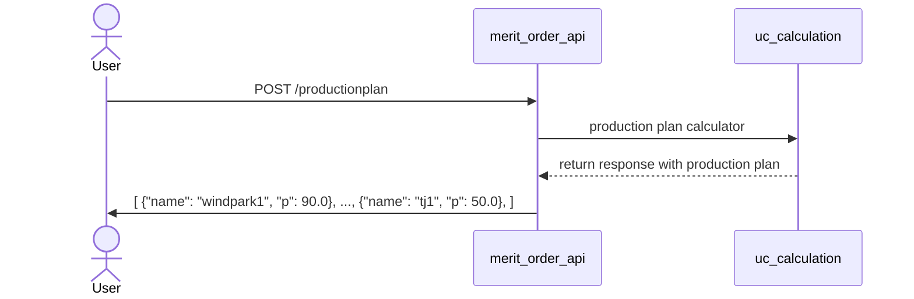

# Powerplant Coding Challenge
## Information
This coding challenge was provided from ENGIE. 
More detail: https://github.com/gem-spaas/powerplant-coding-challenge/blob/master/README.md

## How it works: 

### Architecture
There are 2 components:
- API service: Python Service using FastAPI
- Unit-commitment Calculator: Python module that is providing the choosen powerplants given the payload information to cover the load requirements. 
- tests: To facilitate monitoring and work on the DB.

### Requesting Production-Plan  Diagram
The user has 1 `POST` endpoint to use:
1. Given payload information, a production-plan is returned: `POST` `/productionplan`

Find more information on the next section **__Setup__** > **__Step 6__**

Note: The 3rd GET route shown in the next sequence diagram is not yet released.



## Setup
Make sure to have docker installed locally or you can run it locally directly on your machine. 
Note: If you choose the second option, make sure port 3000 is not allocated already. Also a virtual environment is highly recommended.

1. Build the image:

    ```console
     docker build -t merit-order .
    ```

2. Run the service
    ```console
    docker run -d --name merit-order-app -p 3000:3000 merit-order
    ```
3. To use the API routes, go to http://localhost:3000/docs#. 
   Routes:
   1. **_Merit Order Effect Request_**: POST `/productionplan`:  http://localhost:3000/productionplan
   2. **___healthcheck_**: GET `/_healthcheck`:  http://localhost:3000/_healthcheck

   
## Remaining Tasks & Production Ready changes

### Remaining Tasks
Although, the project structure of the solution it can be considered an over-engineering for this simple use case, 
this is how I would structure the project in order to be scalable and production ready.

In order to conside this a complete production ready MVP, there are few tasks to be done:
* Better Merit Order Effect algorithm
* More logging 
* Logging in json format to be compatible with monitoring solutions (e.g. Sentry or Datadog)
* cleanup and reduce size in Dockerfiles for better performance
* CI/CD workflow tests
* increase coverage of unit tests
* Add API functional tests for every route


### Production & Scalability changes
To consider this solution scalable and production ready I would do the following:

#### API Service:
  * Integrate a Task Queue (e.g. [Celery](https://github.com/celery/celery)) for the `POST` route. Once in place it would allow the endpoint to "pass" the task and not be locked for the duration of the process.
  * Redis Cache for caching each request for 1 day. 
